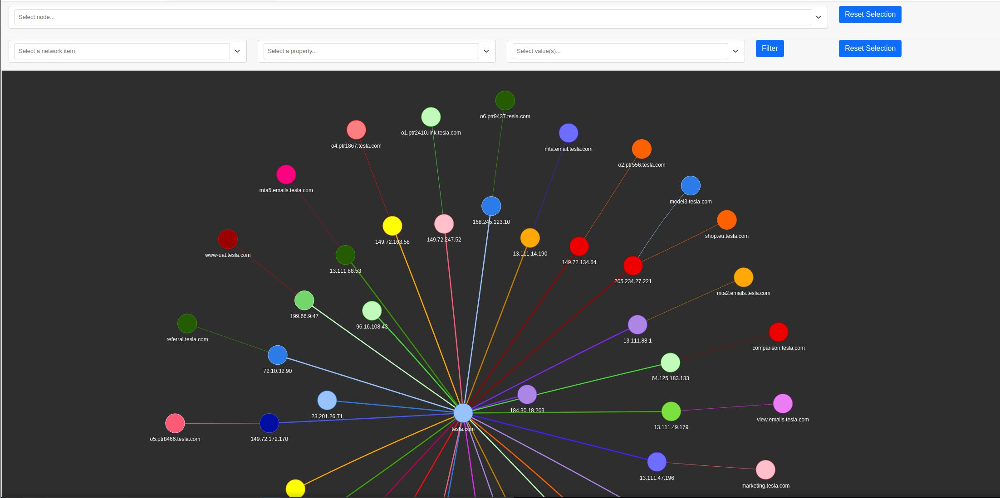
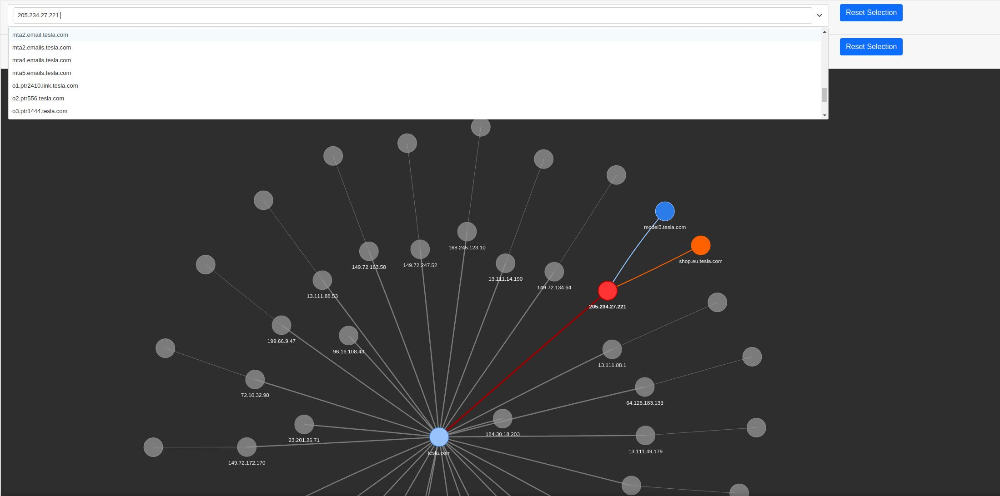

# cobweb 蛛网 - 子域名和解析IP对应关系数据可视化


信息收集过程中，大型目标收集到的子域名和解析IP的关系错综复杂，肉眼分析起来费时又费力。

cobweb 蛛网 将关联数据进行可视化显示，方便快速定位目标资产。

# 效果图

测试页：https://www.se7ensec.cn/cobweb/

网状显示关系可拖动



可手动筛选单独高亮显示



# 使用依赖

> python3
> 
> [sudo pip3 install pyvis]

# 使用方法

1. 安装`dnsx`

```
go install github.com/projectdiscovery/dnsx/cmd/dnsx@latest
```

2. 运行`dnsx`，获取子域名`collect_subdomains.txt`解析结果`active_subdomains2ips.txt`

```
dnsx -l collect_subdomains.txt -silent -a -resp | sed 's/\[//g' | sed 's/\]//g' | tee active_subdomains/active_subdomains2ips.txt
```

3. 运行cobweb.py，浏览器会自动打开

```
usage: cobweb.py --domain example.com --file subdomains2ips.txt

Generate Network Graph For Sudomy.

options:
  -h, --help       show this help message and exit
  --domain DOMAIN
  --file FILE      subdomains2ips.txt

本例：
sudo python3 cobweb.py --domain tesla.com --file active_subdomains/active_subdomains2ips.txt
```

# 感谢

https://github.com/screetsec/Sudomy
